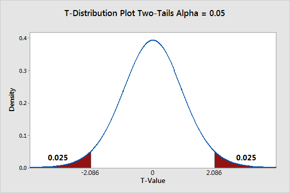

```{r setup, include=FALSE}
library(learnr)
library(gradethis)

knitr::opts_chunk$set(
	echo = FALSE,
	message = FALSE,
	warning = FALSE
)

knitr::knit_engines$set("html") # for linux machines

source("../R/helper_code.R")

# Check whether required packages are installed
pkgs <- matrix(c(
  "learnr", "0.10.5", "CRAN",
  "gradethis", "0.2.8.9000", "rstudio/gradethis",
  "outliertree", "1.8.1-1", "CRAN"
), byrow = TRUE, ncol = 3) |> 
  as.data.frame() |> 
  setNames(c("pkg", "version", "where"))

check_pkgs <- function(.pkgs = pkgs) {
  bootcamp:::check_packages(.pkgs)
}


check_RStudio <- function() {
  bootcamp::check_rstudio_equal_or_larger("2023.6.1", verdict = TRUE)
}

check_R <- function() {
  bootcamp::check_r_equal_or_larger("4.3.1", verdict = TRUE)
}

```

```{css, echo = FALSE}
.tip {
  border-radius: 10px;
  padding: 10px;
  border: 2px solid #136CB9;
  background-color: #136CB9;
  background-color: rgba(19, 108, 185, 0.1);
  color: #2C5577;
}

.warning {
  border-radius: 10px;
  padding: 10px;
  border: 2px solid #f3e2c4;
  background-color: #f3e2c4;
  background-color: rgba(243, 226, 196, 0.1);
  color: #775418;
}

.infobox {
  border-radius: 10px;
  padding: 10px;
  border: 2px solid #868e96;
  background-color: #868e96;
  background-color: rgba(134, 142, 150, 0.1);
  color: #2F4F4F;
}

# # create a horizontal scroll bar when code is too wide
# pre, code {white-space:pre !important; overflow-x:auto}
```

```{html, echo = FALSE}
<style>
pre {
  white-space: pre-wrap;
  background: #F5F5F5;
  max-width: 100%;
  overflow-x: auto;
}
</style>
```


## Introduction

<br>
<br>

You made it to the fourth and final tutorial! Kudos! It's not an easy journey, and you are almost there!


In this tutorial, we will learn how to deal with experimental data and play with the difference between causality and prediction.

Keep climbing the mountain, and you will be rock-solid ready for the exam!

<br>
<br>


## Checking installation

Before we move on with this tutorial, we first quickly 
make sure you have all of the required packages installed.

### R Version 

You need to have installed a recent R version, and this tutorial is going to check it
for you. Please hit the `Run Code` button.

```{r r_check, echo = TRUE, include = TRUE, exercise = TRUE}
check_R()
```


### R Studio Version

You also need to have a recent RStudio version installed.
Let's check by clicking `Run Code`:

```{r rstudio_check, echo = TRUE, include = TRUE, exercise = TRUE}
check_RStudio()
```


### Packages

You need to have a few packages installed. 
Click the `Run Code` button to check. 
It will check whether you have the required packages installed and will 
attempt to install any missing packages in case there are any.

```{r package_check, echo = TRUE, include = TRUE, exercise = TRUE}
check_pkgs()
```

ok, we are ready! let's dance!

<br>
<br>


## Shall we take Marketing classes?

Companies that conduct business need to implement effective marketing strategies to present their products in the most appealing way to their customers. Some people believe that marketing skills are innate in some 'natural born sellers'; others believe that everyone can learn to be good at marketing. 

If you are a school that teaches business people marketing strategies, you definitely belong to the second group :)

Let's consider a fictitious school named 'The Good School of Marketing' (GSM). GSM wants to measure the effective impact of its master's course 'Best marketing strategies for contemporary business'. They are scientists and believe in the experimental method. Hence, they collect data on the 2000 companies with the highest revenue in the country and check whether their CEOs attended their classes. 

Experimental methods are not limited to controlled laboratory settings. A laboratory experiment allows researchers to control the environment and assign treatments under highly controlled conditions. For example, a researcher may give a drug to a group of rats and measure its effect on their ability to complete a maze while keeping temperature, humidity, and food conditions constant.

However, experiments can also take place in real-world settings. These are called **field experiments**. A field experiment evaluates the effect of a treatment outside the laboratory by comparing a group that receives the treatment (treatment group) with a group that does not (control group).

The GSM marketing case is a field experiment scenario because the treatment occurs in a real-world environment: some CEOs attended the marketing course, while others did not. The research question is: does the CEO attending the course affect the number of clients acquired by companies?

Because we are comparing the outcome of two independent groups:

- treatment group: CEOs who attended the GSM course
- control group: CEOs who did not attend the GSM course

the appropriate statistical approach is an **independent two-sample t-test**. This test compares the average number of clients between the two groups to assess whether the observed difference is larger than what could be expected by random variation.

This differs from the Guinness brewing experiment. In the Guinness case, the researcher can randomly assign batches to different brewing processes, creating comparable groups under controlled conditions. This is a randomized experiment, where the treatment assignment is determined by the researcher.

In contrast, in the GSM example, CEOs are not randomly assigned to attend the course. They choose (or are selected) into the treatment group, meaning that differences between groups may exist before the treatment. Therefore, the comparison requires careful consideration of group comparability and possible control variables to separate the effect of the treatment from other factors that may influence company success.

### In short 

- Randomized experiment (Guinness): The researcher assigns the treatment, creating comparable groups and allowing stronger causal conclusions.

 - Field experiment (GSM): The treatment occurs in a real-world setting and outcomes are compared between treated and untreated groups; causal interpretation depends on the comparability of the groups.
 
There are many techniques invented to make the groups more comparable, but we are not going to discuss them here.

For now, focus on the fact that the same statistical methods are valid both for randomized and field experiments. 


Let's look at their data and see what we have here. 

```{r tut04_prepMarketing, echo= FALSE, include = FALSE}

amazon <- bootcamp::amazon
amazon$logo <- as.numeric(amazon$logo)
ma <- amazon[amazon$logo <= 2, ]
marketing <- ma[, -3]
colnames(marketing) <- c("marketing_class", "N_clients", "Online", "N_employees", "MaleCEO")
marketing$marketing_class[marketing$marketing_class == 2] <- 0

```


```{r tut04_01, echo=TRUE, exercise = TRUE, exercise.setup = "tut04_prepMarketing"}
summary(marketing)
```


We have five variables.

- `marketing_class`: did the CEO take the marketing class? YES (1), NO (0)
- `N_clients`: number of clients, used as a proxy for marketing strategy success
- `Online`: Type of business. Online (1), Not online (0)
- `N_employees`: number of employees, proxy for company size
- `MaleCEO`: is the CEO male? YES (1), NO (0)


When a company is successful, it has a broader network of customers who benefit from its products and services. It is straightforward that if no one wants to use its services/product, the company will eventually fail. The network of relationships in which a company is embedded is crucial to its survival and well-being. Do marketing strategies help the company attract clients? The literature on the subject and empirical evidence widely support this idea. Then, in this case, our research question is: Does the GSM master's degree help increase the number of clients? Given our knowledge about GSM (let's pretend ^_^), we believe so. This belief is our research hypothesis. Let's write it down. 

H1: The master's degree offered by GSM affects the number of clients

H0: The master's offered by GSM does not affect the number of clients


Taking the master's is our treatment. We compare the treatment group to a control group that did not take the master's. From this perspective, this is a field experiment because we are monitoring the effect of the treatment outside a lab. We cannot control every condition as much as in a lab. Still, we collect data on some relevant control variables (in this case `Online`, `N_employees`, `MaleCEO`) to ensure that what we observe in the experiment is attributable to the treatment rather than to other conditions that occur by chance. 

From this perspective, our outcome variable is `N_clients`, as we want to assess whether `marketing_class` explains its variation. 

In regression terms, we have `N_clients ~ marketing_class`

Let's move on step by step. 

## By all Mean

When we observe a group of respondents, we cannot possibly analyze the behavior of each one of them. We need to use some measures that are able to communicate quickly and efficiently the population trend. Right? To compare the number of clients of the group of CEO that took the master to the group of CEO that did not take the master, what can we use? Well, statisticians believe that comparing the arithmetic mean of the treatment group to the arithmetic mean of the control group is a good way to see if the treatment has an effect or not on the number of clients. 

Hence we can say that 

H1: $\mu_1 \neq \mu_0$

H0: $\mu_1 = \mu_0$


In fact, if the null hypothesis is correct and the treatment has no effect, the mean of the two groups will be equal.

It does make sense. Do you agree? 


The way we spelled out the difference in the mean above is called two-sided, two-tailed, or bilateral since we consider both positive and negative effects. It is also possible to make assumptions on the direction of the effects, specifying the hypothesis on one side or the other.


If we hypothesize that the treatment group's mean is different than the mean of the control one, we are not making any assumptions concerning the type of effect that the master is producing. Still, we are not only supposing that the effect exists but also that the effect is positive. 

The GSM school believes that the master's helps companies to increase the number of clients. Hence we can further specify our own hypothesis as:

H1: $\mu_1 > \mu_0$

H0: $\mu_1 = \mu_0$


This hypothesis is one tailed. 

In regression terms, we model the relationship as `N_clients ~ marketing_class`, where marketing_class is used to explain variation in the number of clients. When we focus on comparing means, we interpret `marketing_class` as defining two groups: companies whose CEOs attended the GSM course (`marketing_class = 1`) and companies whose CEOs did not (`marketing_class = 0`). The analysis then compares the average number of clients between these two groups to estimate the difference associated with the treatment.


Before we run any kind of statistical test to look for evidence to disprove our hypothesis, we should always look at the data. 

Run the code below to produce a boxplot that shows the difference in mean for the N of clients divided into the treatment and control groups.

```{r boxplot, echo=TRUE, exercise = TRUE, exercise.setup = "tut04_prepMarketing"}

boxplot(N_clients ~ marketing_class,
        data = marketing,
        main = "Effects of Marketing Class on N clients",
        xlab = "Marketing class", 
        ylab = "N clients")

```


Nice! With this boxplot, we can easily see that the average number of clients is much higher for companies whose CEOs attended the master's program! Can you see it? The 1 denotes the boxplot about the treated group, while the 0 is below the boxplot with the control. 

Is this enough to support our hypothesis? I am afraid it is not. In statistics, we talk about statistical significance, right? Is our result random, or does a specific process generate it? AKA, will we get the same result if we repeat the experiment 1000 times? 

Well, let's use a statistical test to check the significance of our result! 


## Statistically significant 

One of the most common tools to check whether the difference in mean between two groups is statistically significant is the t-test. In this case we need an independent two sample t-test, since we have two groups to compare. 

The t-test works with the assumption that both treatment and control groups are sampled from normal distributions with equal variances. Does it ring any bell? Isn't it similar to the linear regression assumption? Well, we will discuss this later...

We can run a t-test in R with the `t.test()` function from the `stats` inbuilt package. 

Explore the function usage by typing 

`?stats::t.test` in your console or the code box below.

We will specify the t-test for our hypothesis similarly to linear regression. Let's try. 


```{r t-test, echo=TRUE, exercise = TRUE, exercise.setup = "tut04_prepMarketing"}

H1test <- stats::t.test(marketing$N_clients ~ marketing$marketing_class, 
                        alternative = "two.sided")

H1test


```

It worked! 

If you pay attention, however, you will see that this is different from the t-test we used in the lecture slides. Let's use the same approach as we did there

```{r t-test_b, echo=TRUE, exercise = TRUE, exercise.setup = "tut04_prepMarketing"}

treatment <- marketing$N_clients[marketing$marketing_class == 1]

control <- marketing$N_clients[marketing$marketing_class == 0]

# Independent two-sample t-test
H1test_b <- stats::t.test(treatment,
                          control,
                          alternative = "two.sided")

H1test_b
```

In the second option, we had to recode the data to extract the entries in the variable `N_clients` corresponding to either the treatment or the control group. The results are equivalent, and you can choose either one according to convenience.  

Both ways we specified the test check the two-sided option. 

What can we say about the result? We have a p-value smaller than 2.2e-16. Therefore, the probability that the observed difference in mean between the treatment and control groups is random is very, very small. So small that we can reject the null hypothesis h0. 

The output also provides the confidence interval. We can read a confidence interval instead of a p-value. 
We have -269.1029 and -229.7591. These two scores are both negative. A confidence interval shows a significant result when both scores are either both positive or both negative. If they have a different sign, they are considered not significant. 

The output also provides us with the estimated mean for each group. These numbers match the two tick lines we observed in the boxplot.

Ok, we have tested the two-sided hypothesis. However, this was not our hypothesis! The University believes that its graduates have a higher number of clients, not a different one (higher or lower)! Now we need to test the hypothesis for real.

Can you do it for me? Pretty, pretty please :)

I will help you. Use the code provided above and substitute "two.sided" with "greater". It checks whether the treatment group's mean is higher than that of the control group and whether this is statistically significant.


```{r testgreater, echo=TRUE, exercise = TRUE, exercise.setup = "tut04_prepMarketing"}


```


```{r testgreater-solution}

H1test <- H1test_b <- stats::t.test(treatment,
                          control,
                          alternative = "greater")


H1test


```


```{r testgreater-check}
gradethis::grade_code(correct = "Great job!")
```


Yes! It is significant! Our treatment group has a statistically significant effect in increasing the number of clients! Lovely! Of course, if you invert the order of the variables in the test you need to specify "less" rather than greater. Also, if you use the regression specification, you need to set your reference category before running the model. 

Why don't you try to check on the possibility that the mean of the treated group is lower than the mean of the control group? Same as above, but you need to specify the option "greater". Give it a go!


```{r testless, echo=TRUE, exercise = TRUE, exercise.setup = "tut04_prepMarketing"}


```


```{r testless-solution}

H1test <- H1test_b <- stats::t.test(treatment,
                          control,
                          alternative = "less")

H1test


```


```{r testless-check}
gradethis::grade_code(correct = "Sweet!")
```


The p-value this time is very high! Hence, we can claim that the Marketing master's is not having a bad effect on companies reducing their number of clients! Good! - carefull though, this claim is valid only for this sample. We cannot claim that this is true in general. 


Now that we know how to run the test, shall we also check what this means in practice? Yes, I know that at the bottom of your heart, you want to :D


Let's take a look at this image.




The figure shows the sampling distribution of the difference between the treatment and control group means under the assumption that the null hypothesis is true. Each point in the distribution represents the result of a hypothetical experiment repeated under the same conditions.

Most simulated experiments produce differences close to zero, because if the treatment has no effect, random variation should create only small differences between groups. The center of the distribution therefore represents outcomes that are most compatible with the null hypothesis.

Our real experiment is statistically significant when the observed difference falls in the extreme tails of the distribution. In a two-tailed test, we consider both directions: a result can be significant if it is unusually large or unusually small compared with what we would expect under the null hypothesis of no effects.

These tail areas represent rare outcomes under $H_0$. The p-value is the probability of observing a result at least as extreme as the one obtained, assuming that the null hypothesis is true. A small p-value means that our observed result would be unlikely to occur by chance alone.

If we specify `alternative = "greater"` in the test, we focus only on the upper tail, because we are testing whether the treatment group has a larger mean than the control group.

If we specify `alternative = "less"`, we focus only on the lower tail, because we are testing whether the treatment group has a smaller mean than the control group.


## ATE with a Linear Regression

The t-test allows us to evaluate whether we can reject the null hypothesis and conclude that there is a statistically significant difference between the treatment and control groups. A boxplot can help us visualize this difference in means. However, neither the t-test nor the boxplot tells us the magnitude of the effect: how much does attending the master's degree increase the number of clients?

As we learned earlier, linear regression also examines how a variable explains variation in a numeric outcome. In this context, regression allows us to compare groups on average, just like a t-test, but it goes one step further by estimating the size of the effect. In other words, it tells us the expected change in the outcome associated with the treatment.

The logic behind the independent two-sample t-test and linear regression is mathematically equivalent when we have a binary treatment variable. Both methods compare the average outcome between two groups. The advantage of regression is that it provides a direct estimate of the treatment effect and can be extended to include additional control variables.

Therefore, we can test our experimental hypothesis using the `lm()` function that you already know.

Shall we try?

First, we need to make sure that our variables have the correct "dress" for the occasion.

`marketing_class` is a dummy variable indicating whether the CEO attended the master's course or not. Since it represents two categories rather than a continuous measurement, we should recode it as a factor before estimating the model.

Then, we can run the model.


```{r linear_reg, echo=TRUE, exercise = TRUE, exercise.setup = "tut04_prepMarketing"}

marketing$marketing_class <- as.factor(marketing$marketing_class)

H1lm <- stats::lm(N_clients ~ marketing_class, 
                        data = marketing)

summary(H1lm)
```

The p-value reported by the regression is smaller than 2.2e-16. This is consistent with the result obtained from the independent two-sample t-test, providing strong evidence against the null hypothesis.

Since the effect is statistically significant, we can move on to interpreting the estimated coefficient. The coefficient of `marketing_class` represents the average difference in the number of clients between CEOs who attended the master's course and those who did not.

According to the model, companies whose CEOs attended the master's course have, on average, 249.431 more clients than companies whose CEOs did not attend the course.

However, this result should not immediately be interpreted as a causal effect. The positive coefficient indicates that the treatment group has a higher average number of clients, but we still need to consider whether other characteristics differ between the two groups and could explain this difference.

When using OLS, the default hypothesis test for each coefficient is two-tailed:


$$H_0: \beta_1 = 0$$


$$H_A: \beta_1 \neq 0$$


If our theoretical hypothesis is directional, for example:

$$H_0: \beta_1 \leq 0$$

$$H_A: \beta_1 > 0$$

we can use the sign of the coefficient together with the statistical evidence to evaluate whether the treatment has a positive effect. A positive coefficient indicates an increase in the outcome, while a negative coefficient indicates a decrease.

The regression confirms the same pattern observed in the t-test: CEOs who attended the master's course are associated with a higher number of clients.

However, are we sure that this difference is caused by the master's course? Not necessarily. Companies whose CEOs attended the course may differ from those whose CEOs did not attend in other important ways.

For this reason, we should include relevant control variables in the regression model. By controlling for factors such as company type, company size, and CEO characteristics, we can reduce the possibility that the observed difference is driven by other characteristics rather than by the treatment itself.

Can you do it for me? 

- check the variables' class
- prepare the variables IF needed.
- insert them into the model

Tip: run `head(marketing)` to refresh what are the other variables. 

```{r linear_reg2, echo=TRUE, exercise = TRUE, exercise.setup = "tut04_prepMarketing"}

# H1lm1 <-


```


```{r linear_reg2-solution}

class(marketing$Online)
class(marketing$N_employees)
class(marketing$MaleCEO)


H1lm1 <- stats::lm(N_clients ~ marketing_class +
                    Online +
                    N_employees +
                    MaleCEO, 
                  data = marketing)

summary(H1lm1)

```


```{r linear_reg2-check}
gradethis::grade_code(correct = "You are on fire!")
```


Here we are! After including the control variables, we observe that none of them has a statistically significant coefficient in the model. This means that, given the data and the model specification, we do not find strong evidence that these variables explain additional variation in the number of clients.

However, this does not mean that we can automatically claim that the marketing class caused the increase in clients. Statistical significance of the control variables is not the criterion for establishing causality. The important question is whether the treatment and control groups are comparable and whether the included controls account for relevant differences between them.

The positive and significant coefficient of `marketing_class` suggests that companies whose CEOs attended the master's course have a higher average number of clients, even after accounting for the available control variables. This provides stronger evidence for a potential treatment effect, but causal conclusions still depend on the quality of the research design and the assumption that important confounding factors have been addressed.

This example also highlights an important distinction between laboratory and field experiments.

Laboratory experiments usually provide stronger control over the conditions of the study. Researchers can assign the treatment, keep other conditions constant, and minimize the influence of external factors. Because of this control, it is easier to attribute differences in outcomes directly to the treatment. This makes laboratory experiments particularly powerful for identifying causal relationships.

Field experiments take place in real-world environments, where many factors cannot be controlled. This gives them higher external validity because they study effects in realistic settings, but it also makes causal interpretation more challenging. In real life, treatment and control groups may differ in many ways that are not observed by the researcher. These unmeasured factors may influence the outcome and create a difference between groups that is not caused by the treatment itself.

Therefore, when we observe a relationship between a treatment and an outcome in a field setting, we need to ask whether this relationship reflects a true causal effect or whether it is partly explained by other factors that we have not measured.

The challenge of causal inference is precisely to distinguish between:


- Observed difference in outcomes


and


- Difference in outcomes caused by the treatment

Randomized experiments achieve this by making treatment and control groups comparable by design. Observational field studies, instead, require additional methods such as regression controls, matching, or other causal inference techniques to reduce the influence of confounding factors.


## Predicting the Future

Let's return to the simplest version of our model, where we use `N_clients` as the outcome variable and `marketing_class` as the predictor.

So far, we used this model to estimate the average difference between companies whose CEOs attended the master's course and those whose CEOs did not. In other words, we interpreted the coefficient of `marketing_class` as an estimate of the treatment effect.

Now, we change perspective. Instead of asking whether the master's course causes an increase in clients, we ask a predictive question:

> Given the pattern learned from our data, what number of clients would the model predict for a new company?

Our original `marketing` dataset is our **training dataset**: the data used to estimate the relationship between `marketing_class` and `N_clients`.

We now create a small **test dataset** containing new observations for which we want predictions. Since our model uses only `marketing_class` as a predictor, the new dataset only needs to contain this variable.


```{r linear_regPred, echo=TRUE, exercise = TRUE, exercise.setup = "linear_reg"}

p <- data.frame("marketing_class" = as.factor(c(0, 1)))

p

predict(H1lm, newdata = p)
```


The object p contains two hypothetical new companies:

- Entry 1: `marketing_class = 0` → the CEO did not attend the master's course.
- Entry 2: `marketing_class = 1` → the CEO attended the master's course.

We can now use the model trained on the original data to predict their expected number of clients:

```{r linear_regPredb, echo=TRUE, exercise = TRUE, exercise.setup = "linear_regPred"}

predict(H1lm, newdata = p)
```

The `predict()` function applies the relationship learned by the regression model to new observations. The output represents the model's expected value of N_clients for each hypothetical company.

Notice that the same regression model can therefore be interpreted in two different ways:

- Causal inference: the coefficient of marketing_class estimates the average difference associated with the treatment, under causal assumptions.
- Prediction: the model uses the observed pattern between marketing_class and N_clients to generate expected outcomes for new cases.

We can now use our model to make predictions for prospective companies. According to the model, a company whose CEO did not attend the master's course is predicted to have around 508 clients, while a company whose CEO attended the master's course is predicted to have around 757 clients.

Can we recognize these values? They correspond exactly to the average number of clients observed in the control and treatment groups.

Ahhh, how fun is mathematics? ^_^

This happens because our model contains only one binary predictor: `marketing_class`. With a dummy variable, the regression model simply estimates the average outcome for each group. The intercept represents the mean outcome for the reference group (`marketing_class = 0`), while the coefficient of `marketing_class` represents the difference between the treatment and control group means.

However, this is a very simple model. In reality, companies differ in many ways, and we have additional information that may help us make more accurate predictions.

Let's now use all the information available by creating a more informative test dataset.

The new `p` data frame contains three hypothetical companies with values for all four variables included in our model. All three companies are offline businesses with approximately 50 employees. The only difference between them is whether the CEO attended the master's course and whether the CEO is male or female.

We can therefore use the model to explore how these characteristics influence the predicted number of clients. 


```{r lm1, echo=FALSE, exercise = FALSE, exercise.setup = "tut04_prepMarketing" }

marketing$marketing_class <- as.factor(marketing$marketing_class)
H1lm1 <- stats::lm(N_clients ~ marketing_class +
                    Online +
                    N_employees +
                    MaleCEO, 
                  data = marketing)


```


```{r linear_regPred2, echo=TRUE, exercise = TRUE, exercise.setup = "lm1"}

p <- data.frame("marketing_class" = as.factor(c(1,0,1)), 
                                              "Online" = as.factor(c(1, 1, 1)),
                                              "N_employees" = c(50, 50, 50),
                                              "MaleCEO" = as.factor(c(1, 1, 0))) 
p

predict(H1lm1, newdata = p)
```


Looking at the predictions, we can compare companies with the same characteristics and observe how the model changes its expected number of clients.

According to the model, being a woman CEO is not associated with a meaningful difference in the predicted number of clients. In fact, the third entry represents a female CEO, and keeping the other characteristics constant, the model predicts around 7 more clients compared with the male CEO in the first entry, who also attended the master's course.

However, this difference should be interpreted carefully. In a predictive model, these values represent differences in predicted outcomes based on the patterns learned from the data. They do not automatically imply that CEO gender causes an increase or decrease in the number of clients.

Needless to say, these predictions can also be calculated manually using the regression equation, as we practiced during the Day 3 lab.

More advanced approaches, such as machine learning algorithms, neural networks, and artificial intelligence models, use more sophisticated techniques to identify patterns and generate predictions. However, the underlying logic remains the same: learn relationships from existing data and use them to make predictions for new observations.

At the same time, statistical models can become much more complex than the simple linear regression model used here. The distinction between causal inference and prediction is therefore not a distinction between "simple statistics" and "real data science."

Both are important ways of learning from data. Asking whether causal inference is more or less data science than prediction is like asking whether fish and chips are less of a food than pizza: they are different approaches serving different purposes, but both belong to the same broader field of understanding data.

## Homeplay 

Diabetes type II is one of the most common chronic diseases worldwide. People affected by diabetes often have elevated hemoglobin (HbA1c) levels, which provide an indication of their average blood sugar over the past few months. While a healthy individual typically has a value around 5%, diabetic patients can have substantially higher levels.

A pharmaceutical company has developed a promising new diabetes medication. Before investing millions of dollars in large-scale production, it wants to evaluate whether the new drug performs better than the current standard treatment.

Sixteen volunteers diagnosed with diabetes participate in a pilot clinical trial. Half receive the standard treatment, while the other half receive the new medication. Hemoglobin is measured before the treatment begins and again after the treatment period.

In this dataset you have information on the 16 participants:

-  `treatment` = treatment assigned (Standard, New)
-  `pre` = hemoglobin level before treatment
-  `post` = hemoglobin level after treatment
-  `age` = participant's age
- `sex` = participant's sex

We are interested in answering 2 research questions: 

- 1) Which treatment performs better?
- 2) Does a treatment improve patients `HbA1c` over time?

```{r tut04_homeplay, echo= FALSE, include = FALSE}

diabetes <- data.frame(
  id = 1:30,
  treatment = c(rep("Standard", 15), rep("New", 15)),
  pre = c(
    8.2, 7.8, 8.5, 9.1, 7.9,
    8.7, 8.3, 9.0, 7.6, 8.4,
    8.8, 7.7, 8.6, 9.2, 8.1,
    8.4, 8.9, 8.1, 9.3, 8.5,
    8.0, 8.7, 9.1, 8.3, 8.6,
    9.0, 8.2, 8.8, 7.9, 8.5
  ),
  post = c(
    7.9, 7.5, 8.2, 8.7, 7.6,
    8.3, 8.0, 8.6, 7.4, 8.1,
    8.4, 7.5, 8.2, 8.8, 7.8,
    7.4, 7.8, 7.1, 8.0, 7.5,
    7.2, 7.7, 7.9, 7.3, 7.6,
    7.8, 7.1, 7.5, 7.0, 7.4
  ),
  age = c(
    54, 62, 47, 59, 51,
    66, 45, 58, 53, 61,
    49, 57, 64, 55, 60,
    52, 68, 46, 63, 50,
    56, 59, 48, 65, 54,
    62, 47, 58, 51, 60
  ),
  sex = c(
    "F", "M", "M", "F", "F",
    "M", "F", "M", "F", "M",
    "M", "F", "F", "M", "M",
    "F", "M", "F", "M", "F",
    "F", "M", "M", "F", "M",
    "F", "M", "F", "M", "F"
  )
)

diabetes

```

### Questions for you to answer

- a) What are the two hypotheses you are testing to answer the research questions?
(Remember that hypotheses are attempted answers to be verified)

- b) Which type of t-test do you need for testing each hypothesis

- c) Would these two t-test be one or two tailed?

- d) Can you inspect the difference between the `HbA1c` level in the two groups?


```{r, boxplotHomeplay, echo=TRUE, exercise = TRUE, exercise.setup = "tut04_homeplay"}


```


```{r boxplotHomeplay-solution}

boxplot(post ~ treatment,
        data = diabetes,
        main = "Hemoglobin levels",
        xlab = "Groups",
        ylab = "HbA1c",
        col = c("lightblue", "lightgreen"))


```

```{r boxplotHomeplay-check}
gradethis::grade_code(correct = "Great job!")
```


e) Please, test the first hypothesis 
(remember than the new drug is supposed to lower the level of `HbA1c`)


```{r type2, echo=TRUE, exercise = TRUE, exercise.setup = "tut04_homeplay"}


```


```{r type2-solution}
t.test(post ~ treatment,
       data = diabetes,
       alternative = "less")
```


```{r type2-check}
gradethis::grade_code(correct = "Great job!")
```


In order to test the second hypothesis we need to focus only on the people who took the new drug, 
hence, we subset the full data set only keeping the observation relevant for us

```{r type3data, echo=TRUE, include=TRUE, exercise = TRUE, exercise.setup = "tut04_homeplay"}
new <- subset(diabetes, treatment == "New")
```

f) Please, test the second hypothesis 
(remember than the new drug is supposed to lower the level of `HbA1c`)

```{r type3, echo=TRUE, exercise = TRUE, exercise.setup = "type3data" }


```


```{r type3-solution }
t.test(new$pre,
       new$post,
       paired = TRUE,
       alternative = "greater")
```

```{r type3-check}
gradethis::grade_code(correct = "Great job!")
```


g) can you check the average treatment effect and test the first hypothesis at the same time
(remember to consider the control variables you have)


```{r ate, echo=TRUE, exercise = TRUE, exercise.setup = "tut04_homeplay"}


```

```{r ate-solution}
model_ate <- lm(post ~ treatment + age + sex, data = diabetes)

summary(model_ate)

```


```{r ate-check}
gradethis::grade_code(correct = "Great job!")
```

h) How can you estimate an ANOVA table from the model estimated with `lm()`?


```{r anova, echo=TRUE, exercise = TRUE, exercise.setup = "tut04_homeplay"}
```


```{r anova-solution}
model_ate <- lm(post ~ treatment + age + sex, data = diabetes)
anova(model_ate)
```


```{r anova-check}
gradethis::grade_code(correct = "Great job!")
```

i) What is the answer to the two RQs? 
(remember to discuss, rejection of the null, ATE, role played by control variables)

## Conclusion

You got to the end of the tutorial! Well done! Be proud of yourself!


<br>
<br>


